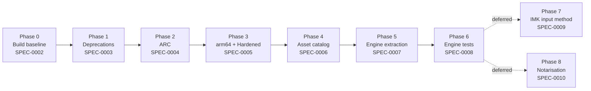

# SPEC-0001: Modernisation roadmap

**Status:** approved
**Owner:** @tieubao
**Depends on:** none
**Blocks:** SPEC-0002 through SPEC-0010

## Problem

NAKL was written in 2012 against macOS 10.5, with manual reference counting, Carbon-era hotkey libraries, and a `CGEventTap`-based input model. It does not build on current Xcode without setting changes, has not been tested on Apple Silicon, and uses several APIs that are deprecated or removed on macOS 12+. Future maintenance is also blocked by the fact that the Vietnamese transformation engine is entangled with global C state and the AppKit event-tap callback, making it untestable in isolation.

## Goal

Define the staged path from "Objective-C/MRC app for macOS 10.5" to "modern, testable Vietnamese input on macOS 12+", and identify which stages are committed to vs deferred.

## Non-goals

- Notarisation and signed distribution. Personal-use binaries only until SPEC-0010 is approved.
- App Store submission. Out of scope; would force IMK and sandboxing decisions we are not ready to make.
- UI redesign. Preferences window stays as-is unless a deprecation forces a change.
- Switching language. Objective-C stays; no Swift mixing yet.

## Decision

Path C from the planning conversation: modernise the existing `CGEventTap` codebase first, then build an InputMethodKit (IMK) target that reuses the extracted engine. Rationale and alternatives are recorded in [ADR-0001](../adr/0001-cgevent-tap-vs-imk.md).

The pivot of the whole roadmap is **SPEC-0007 (engine extraction)**: pulling the Telex/VNI logic out of `KeyboardHandler` into a pure module with zero globals and zero AppKit dependencies. Both the existing `CGEventTap` and the future IMK target call the same engine, and the engine itself becomes unit-testable.

## Phase dependency

## Phases

| Phase | Spec | Outcome | Approx effort | Commitment |
|---|---|---|---|---|
| 0 | SPEC-0002 | Builds on Xcode 16; deployment target 12.0; arm64 + x86_64 | 0.5 day | committed |
| 1 | SPEC-0003 | All non-blocking deprecations removed | 0.5 day | committed |
| 2 | SPEC-0004 | App-target sources migrated to ARC | 1 day | committed |
| 3 | SPEC-0005 | Hardened Runtime; "Sign to Run Locally" works | 0.5 day | committed |
| 4 | SPEC-0006 | Modern asset catalog, all icon sizes | 0.25 day | committed |
| 5 | SPEC-0007 | Engine extracted into pure module under `NAKL/Engine/` | 1.5 days | committed |
| 6 | SPEC-0008 | XCTest target plus golden corpus, ≥95% pass | 1 day | committed |
| 7 | SPEC-0009 | IMK target shipping the same engine | 2-3 weeks | reopened after phase 6 |
| 8 | SPEC-0010 | Notarised DMG pipeline | 1-2 days | reopened when sharing |

## Acceptance criteria for the roadmap (not the implementation)

- [ ] `specs/0002-*.md` through `specs/0008-*.md` are drafted and approved before phase 0 begins.
- [ ] `specs/0009-imk-input-method.md` is drafted at status `draft` (not `approved`) before phase 0 begins, so the eventual IMK contract is visible early.
- [ ] [ADR-0001](../adr/0001-cgevent-tap-vs-imk.md) (CGEventTap vs IMK) is written and linked from this spec.
- [ ] SPEC-0007 (engine extraction) explicitly enumerates every global variable and AppKit dependency that must be removed.

## Test plan

This spec is not directly testable; its acceptance criteria are met when the dependent specs exist and link back here.

## Implementation notes

- Each phase ends with a buildable, runnable app you can smoke-test (toggle method, type "tieng viet" → "tiếng việt", switch hotkey, exclude an app). No phase is allowed to leave the app non-functional.
- Vendored libraries (`ShortcutRecorder/`, `HotKey/PT*`) stay in tree across phases 0-6. Decision to retain or replace will be made in their own ADR when phase 1 or 2 forces the issue.
- Phase 7 rebuilds the input shell as an IMK target. The Preferences UI and excluded-apps logic do not survive that boundary cleanly and will need separate specs at that point.

## Open questions

- Where does the engine live in the source tree? Proposal: `NAKL/Engine/` as a sibling of `NAKL/HotKey/` and `NAKL/ShortcutRecorder/`. SPEC-0007 settles this.
- Should phase 6's golden corpus be hand-written, generated from xvnkb's reference output, or both? Settled in SPEC-0008.
- Do we keep `ShortcutRecorder` and `PTHotKey` as vendored Carbon code or swap for `MASShortcut`? Decision deferred to whichever spec first touches them.

## Changelog

- 2026-04-27: drafted
- 2026-04-27: approved (SPEC-0002 through SPEC-0008 drafted and approved; SPEC-0009 drafted at `draft`; ADR-0001 written)
