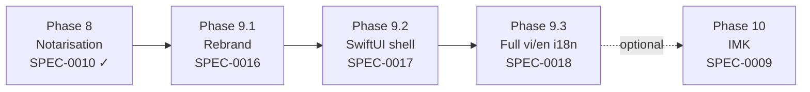

# SPEC-0015: Phase 9 roadmap — redistribution and UI v2

**Status:** done
**Owner:** @tieubao
**Depends on:** SPEC-0001 (amends), SPEC-0010, SPEC-0011
**Blocks:** SPEC-0016, SPEC-0017, SPEC-0018

## Problem

SPEC-0001 (modernisation roadmap) explicitly listed two items as **non-goals**:

- "UI redesign. Preferences window stays as-is unless a deprecation forces a change."
- "Switching language. Objective-C stays; no Swift mixing yet."

That stance was correct for Phases 0–8: it kept the modernisation focused on build-system, ARC, engine extraction, tests, and notarisation without bundling a UI rewrite. With those phases either done (0–6, 8, 11) or gated on a separate user decision (Phase 7 / SPEC-0009 IMK), the roadmap now needs an explicit Phase 9 that addresses three goals the user has made load-bearing:

1. **Redistribute the app under a new product identity** (new display name, new bundle identifier) so the lineage from the 2012 codebase is visible but the released product is clearly the modernised line.
2. **Rebuild the UI to the latest macOS HIG**, which on macOS 14+ effectively means SwiftUI's `MenuBarExtra` + `Settings` scenes plus modern controls. The legacy XIB-driven Preferences window does not satisfy current HIG guidance and does not localise cleanly.
3. **Ship full English + Vietnamese parity**, dynamic switchable, replacing today's "vi.lproj only overrides Info.plist" stub.

These three goals are interdependent: rebrand changes the bundle ID that the SwiftUI app registers with `SMAppService` and the notarisation pipeline; SwiftUI rewrite is the prerequisite that makes localisation cheap (single `.xcstrings` catalog vs dual XIBs); the rebrand should land on the new UI rather than the old to avoid double-migrating user state.

## Goal

Define Phase 9 of the SPEC-0001 roadmap as three child specs (SPEC-0016 rebrand, SPEC-0017 SwiftUI shell, SPEC-0018 localisation) executed in that order, with the explicit understanding that this phase reverses two of SPEC-0001's original non-goals.

## Non-goals

- Implementing any of the three child specs in this umbrella. Each child has its own approval gate and acceptance criteria.
- Reopening SPEC-0009 (IMK). This phase is independent: if the user later approves SPEC-0009, it absorbs the SwiftUI Preferences shell built here as its Preferences host (per SPEC-0009 §"Hotkey + excluded-apps + status bar"). No conflict.
- Changing the Vietnamese transformation engine. SPEC-0007's pure-C module is the contract; nothing in Phase 9 calls into the engine other than via the existing `nakl_engine_*` C ABI.
- Migrating the menu-bar app to the App Store. CGEventTap + Accessibility permission rules out sandbox compliance; that remains an SPEC-0009 concern if ever.

## Decision

Phase 9 = three sequential specs.

Why this order:

- **Rebrand first.** Bundle ID and product name are referenced by the notarisation script (SPEC-0010), `SMAppService` registration (SPEC-0011), Application Support directory (`NSFileManager+DirectoryLocations`), and entitlements. Doing rebrand before the SwiftUI rewrite keeps the SwiftUI work scoped to "rewrite views" instead of "rewrite views and rename everything". The user-data migration shim is small (a one-time `NSUserDefaults` + Application Support copy) and only has to be written once.
- **SwiftUI shell second.** Bumps `MACOSX_DEPLOYMENT_TARGET` from 12.0 to 14.0, retires `ShortcutRecorder/` and `HotKey/PT*` vendored libs, replaces `AppDelegate.m` + `Preferences.xib` with a SwiftUI `@main App`. Keeps `KeyboardHandler.{h,m}` + the C engine + the `CGEventTap` event loop intact (they are wrapped, not rewritten). The SwiftUI scene structure is what makes localisation cheap in the next step.
- **Localisation third.** With XIBs gone, every UI string is in Swift `String(localized:)` calls, which the Xcode toolchain extracts into a single `Localizable.xcstrings` catalog. vi.lproj parity becomes "translate the catalog" plus a runtime language picker.

## Roadmap update

Append to SPEC-0001's phase table (do not edit SPEC-0001; supersede later if scope grows):

| Phase | Spec | Outcome | Approx effort | Commitment |
|---|---|---|---|---|
| 9.1 | SPEC-0016 | New product name + bundle ID; user-data migration shim; updated notarisation identity | 1 day | committed |
| 9.2 | SPEC-0017 | SwiftUI `@main App` with `MenuBarExtra` + `Settings`; deployment target 14.0; vendored hotkey libs retired | 3-4 days | committed |
| 9.3 | SPEC-0018 | Full vi/en parity via `Localizable.xcstrings`; runtime language switch | 1-2 days | committed |

After Phase 9.3 lands, SPEC-0001's "UI redesign" and "Swift mixing" non-goals are formally retired. The user's call whether to add a row to SPEC-0001's changelog noting the reversal or supersede SPEC-0001 with an SPEC-0001-revised; recommendation: **add a one-line changelog entry, do not supersede**, since SPEC-0001's Phases 0–8 remain authoritative history.

## Acceptance criteria for the roadmap (not the implementations)

- [ ] `specs/0016-*.md`, `specs/0017-*.md`, `specs/0018-*.md` exist at status `draft` with this spec's commit, so the full Phase 9 contract is visible before any code lands.
- [ ] SPEC-0016 names the new product identity (display name + bundle ID) or marks it as the single open question blocking its own approval.
- [ ] SPEC-0017 explicitly enumerates which existing files survive (engine, `KeyboardHandler.{h,m}`, `AppData.{h,m}`, `NSFileManager+DirectoryLocations.{h,m}`) and which are deleted (`AppDelegate.{h,m}`, `Preferences.xib`, `MainMenu.xib`, `ShortcutRecorder/`, `HotKey/`, `PreferencesController.{h,m}`, `ShortcutTableViewController.{h,m}`, `ExcludedAppsTableViewController.{h,m}`).
- [ ] SPEC-0018 specifies the `.xcstrings` catalog as the single source of truth and explicitly retires `en.lproj/Preferences.xib`, `en.lproj/MainMenu.xib`, `en.lproj/ShortcutRecorder.strings` from the localisation surface (those files are deleted entirely by SPEC-0017's XIB removal).
- [ ] SPEC-0010 (notarisation) is updated by SPEC-0016's implementation with the new bundle identifier, or the existing script's env-var override is sufficient; the SPEC-0016 acceptance criteria call this out.

## Test plan

This spec is not directly testable; its acceptance criteria are met when the three child specs exist as drafts and link back here.

## Implementation notes

- Each child phase ends with a buildable, runnable app the user can smoke-test exactly as SPEC-0001 §"Implementation notes" requires: toggle method, type "tieng viet" → "tiếng việt", switch hotkey, exclude an app. No phase is allowed to leave the app non-functional.
- The user-data migration shim in SPEC-0016 must run **once**, on the first launch of the renamed app, and idempotently (re-running is a no-op). Subsequent launches must not re-copy.
- The SwiftUI rewrite in SPEC-0017 is mixed-language: Swift for the App / Scenes / Views; ObjC stays for `KeyboardHandler`, `AppData`, and the `CGEventTap` callback. A bridging header exposes the ObjC interfaces to Swift; ObjC sees Swift via the auto-generated `<Module>-Swift.h` import.
- The localisation work in SPEC-0018 lands the `.xcstrings` catalog *after* the XIBs are gone, otherwise we would localise a UI we are about to delete.

## Open questions

Resolved at approval:

- **Should SPEC-0001 be superseded, or kept and amended?** Recommendation: **kept and amended**. SPEC-0001's Phases 0–8 are correct history; superseding implies they were wrong, which they were not. A `2026-XX-XX: Phase 9 added per SPEC-0015` line in SPEC-0001's changelog is the right footprint.
- **What if SPEC-0009 (IMK) is approved during Phase 9?** SPEC-0009 explicitly retains the menu-bar `NAKL.app` (or its renamed successor) as the Preferences host. Phase 9 builds that host. No conflict; the IMK target consumes the same shared `NSUserDefaults` suite the rebrand defines. If both run concurrently, IMK is the architectural change; Phase 9 is the UX change. They land on independent branches.
- **Does Phase 9 require an ADR?** No. ADR-0001 covered CGEventTap-vs-IMK, the load-bearing architectural decision. The Swift-vs-ObjC and SwiftUI-vs-AppKit choices in SPEC-0017 are recorded in that spec's "Implementation notes"; an ADR would duplicate. If a future spec proposes another architectural reversal (e.g., dropping CGEventTap entirely), that gets its own ADR.

## Changelog

- 2026-04-27: drafted
- 2026-04-27: approved. Phase 9 = three child specs (SPEC-0016 rebrand, SPEC-0017 SwiftUI shell, SPEC-0018 vi/en localisation), executed in that order. SPEC-0001's "UI redesign" and "Switching language" non-goals are formally retired (see SPEC-0001 changelog). Recommendation to keep-and-amend SPEC-0001 (not supersede) is adopted.
- 2026-04-27: done. Implementation umbrella satisfied: SPEC-0016 landed in `8d35b24`, `97b1bec`, `86cf82a`; SPEC-0017 in `012de86` (phase a) + `e89f927` (phase b); SPEC-0018 in `63861c2`. Deferrals (SPEC-0017 Group B `MenuBarExtra`, Group D `KeyboardShortcuts` SPM) tracked in SPEC-0017's changelog as candidates for follow-up SPECs.
